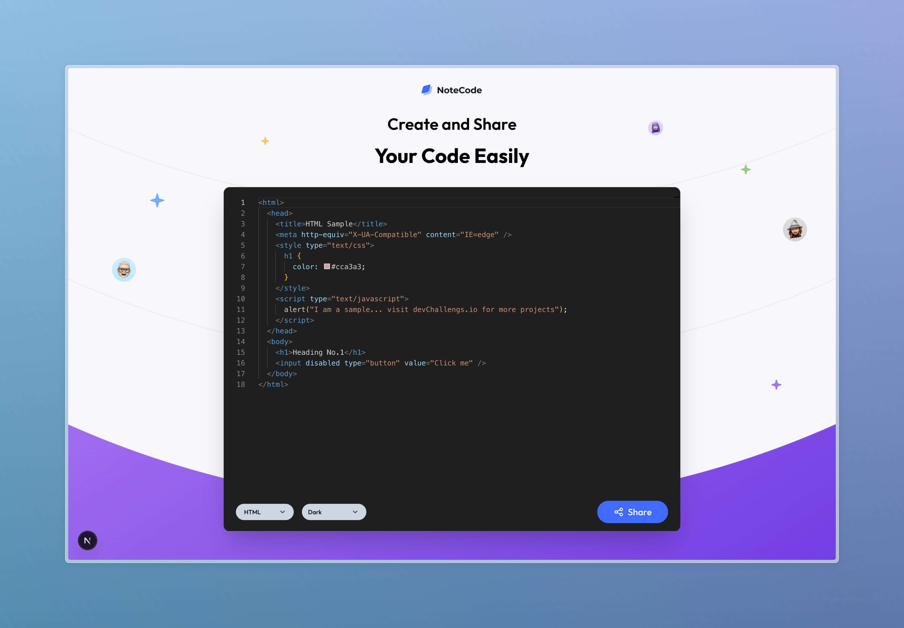

<!-- Please update value in the {}  -->

<h1 align="center">Coding Sharing | devChallenges</h1>

   Solution for a challenge <a href="https://devchallenges.io/challenge/code-shraing-app-note-code" target="_blank">Coding Sharing</a> from <a href="http://devchallenges.io" target="_blank">devChallenges.io</a>.

  <h3>
	<a href="https://your-demo-link.vercel.app">
	  Demo
	</a>
	 | 
	<a href="https://github.com/ramatya00/dev-challanges-fullstack-app/tree/main/note-code">
	  Solution
	</a>
	 | 
	<a href="https://devchallenges.io/challenge/code-shraing-app-note-code">
	  Challenge
	</a>
  </h3>

<!-- TABLE OF CONTENTS -->

## Table of Contents

- [Overview](#overview)
    - [What I learned](#what-i-learned)
    - [Useful resources](#useful-resources)
- [Built with](#built-with)
- [Features](#features)
- [Contact](#contact)
- [Acknowledgements](#acknowledgements)

<!-- OVERVIEW -->

## Overview

NoteCode is a simple **code-sharing app** built for the _Coding Sharing | devChallenges_ challenge.

Users can write code in a Monaco editor, pick language & theme, share it, and then access it again via a unique URL. Shared snippets are stored in a PostgreSQL database through Prisma.

### What I learned

- Using **Next.js App Router** with client components and server actions in the same project.
- Setting up **Prisma + PostgreSQL** in a full-stack Next.js app, including a small schema for `Snippet` storage.
- Integrating **Monaco Editor** via `@monaco-editor/react` and configuring options (themes, language switching, layout, etc.).
- Implementing share logic with **URL query parameters** (`/?id=...`) instead of classic REST routes.
- Managing UI state for the **Share button** (enabled/disabled depending on whether a snippet has been shared and edited).
- Deploying a full-stack Next.js + Prisma app and wiring it up to a managed Postgres instance.

### Useful resources

- [Next.js Documentation](https://nextjs.org/docs) – App Router, client/server components, and deployment docs.
- [Prisma Documentation](https://www.prisma.io/docs) – schema design, migrations, and using PostgreSQL.
- [@monaco-editor/react docs](https://github.com/suren-atoyan/monaco-react) – integrating Monaco in React/Next.js.
- [devChallenges](https://devchallenges.io/) – original challenge description and requirements.

### Built with

<!-- This section should list any major frameworks that you built your project using. Here are a few examples.-->

- [Next.js](https://nextjs.org/) (App Router)
- [React](https://reactjs.org/) + TypeScript
- [Tailwind CSS](https://tailwindcss.com/)
- [Monaco Editor](https://github.com/microsoft/monaco-editor) via `@monaco-editor/react`
- [Prisma](https://www.prisma.io/) ORM
- PostgreSQL

## Features

<!-- List the features of your application or follow the template. Don't share the figma file here :) -->

- Default **HTML snippet** loaded on first visit.
- **Monaco code editor** with support for multiple languages (HTML, CSS, JavaScript, TypeScript, Python, Java).
- Switchable **editor themes** (dark, light, high contrast).
- **Share** functionality that:
    - Saves the current snippet to the database.
    - Redirects to `/?id=<snippet-id>`.
    - Disables the Share button until the code is edited again.
- **Copy link** UI to easily copy the current snippet URL.
- Responsive layout designed to work on different screen sizes.
- Backend powered by Next.js server actions + Prisma instead of classic REST routes.

## Acknowledgements

<!-- This section should list any articles or add-ons/plugins that helps you to complete the project. This is optional but it will help you in the future. For exmpale -->

- devChallenges team for providing the design and feature requirements.
- Next.js, Prisma, and Monaco communities for documentation and examples.

## Author

- Website [ramatya.com](https://ramatya.com)
- GitHub [@ramatya00](https://github.com/ramatya00)
